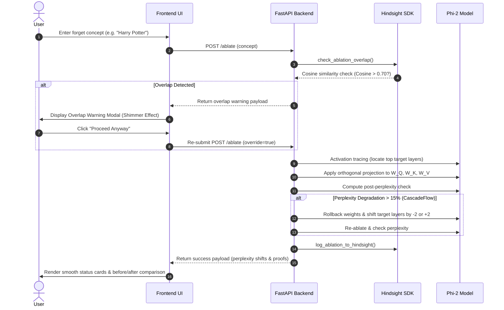
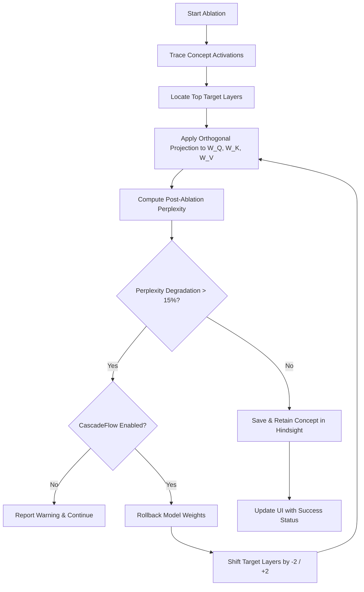

# Vector Space Ablation Engine (VSAE)

> **Surgical Knowledge Removal & Model Unlearning — Optimized for Microsoft Phi-2**

---

[](https://fastapi.tiangolo.com)
[](https://pytorch.org)
[](https://hindsight.dev)
[](LICENSE)

The **Vector Space Ablation Engine (VSAE)** is a highly optimized, full-stack framework designed for surgical, real-time unlearning and knowledge removal in Large Language Models (LLMs). By targeting key weight projections in the self-attention subspace (`W_Q`, `W_K`, `W_V`), VSAE removes target concepts without full retraining or extensive fine-tuning.

This project is tailored specifically for the **Microsoft Phi-2 (2.7B)** architecture using high-precision FP16 tensors on Apple Silicon (MPS) and CUDA platforms.

---

## Architectural Workflow

VSAE dynamically intercept requests, evaluates semantic safety, tracing target concept pathways, surgically nullifies target weights, and verifies language state integrity:



---

## Key Pillars & Core Features

### 1. Surgical Orthogonal Projection
*   **Activation Tracing**: Dynamically traces forward passes of target text prompts to construct highly specific semantic "forget vectors" ($\vec{v}$) across the embedding layer.
*   **Orthogonal Projections**: Rewrites model projection matrices in attention subspaces ($W_Q$, $W_K$, $W_V$) to project activations onto the null space of $\vec{v}$:
    $$W_{\text{new}} = W - \vec{v}\vec{v}^T W$$
*   **Precision Rollbacks**: Instantly restores the original model parameters in-memory from cached copies without re-downloading or reloading model checkpoints.

### 2. CascadeFlow (Self-Healing Recovery)
To combat general capability degradation during aggressive unlearning, VSAE features **CascadeFlow**:

*   **Self-Healing Threshold**: If post-ablation perplexity on benchmark prompts degrades by more than **15%**, CascadeFlow rolls back the ablation weights.
*   **Layer Shifting**: Automatically shifts target layers by $-2$ layers (earlier) or $+2$ layers (later) and retries the process until unlearning is successful within the safety threshold.

### 3. Hindsight SDK Integration
VSAE is seamlessly integrated with the **Hindsight memory client** for intelligent unlearning guardrails:
*   **Semantic Overlap Detection**: Pre-emptively scans historical deletion records via `client.recall()` using vector cosine embeddings.
*   **Stacking Warnings**: Triggers warning modals if a concept overlaps by more than **70%** with a past ablation, detailing expected cumulative perplexity degradation.
*   **Ablation History Storage**: Logs newly ablated concepts using the Hindsight semantic recall structure:
    `"Ablated concept: [concept] at layers [layers] with post_perplexity [perplexity]"`
*   **Hindsight Cache Clearer**: Built-in trash capability to instantly wipe memory logs (`POST /history/clear`) and run fresh diagnostic unlearning tests cleanly.

---

## 📁 Project Directory Layout

```bash
vsae/
├── backend/
│   ├── __init__.py
│   ├── ablation.py      # Core orthogonal projections, Hindsight logs, CascadeFlow layer shifting
│   ├── embedding.py     # Phi-2 model/tokenizer loading, forget vectors, FP16 activations
│   ├── evaluate.py      # Perplexity evaluation suite and pre/post baseline statistics
│   ├── locator.py       # Activation scoring across multi-head attention layers
│   └── main.py          # FastAPI REST API endpoints, routing, and static file serving
├── frontend/
│   ├── index.html       # Sleek UI, glassmorphism layout, 3D Three.js Globe Sphere
│   ├── app.js           # Full state management, API fetches, cache-busted loading (?v=25)
│   └── style.css        # Premium Dark-Gold CSS theme with shimmery warning animations
├── test_vsae.py         # 6-step backend & integration test suite
├── requirements.txt     # Python environment requirements
├── setup.sh             # Interactive, automated developer setup script
└── ablation_history.json# Local persistent fallback database for Hindsight memory
```

---

## Developer Setup & Run Guide

### Prerequisites
*   **Python**: Version 3.10+
*   **RAM**: 16GB minimum (32GB recommended for fast FP16 execution)
*   **Hardware**: Apple Silicon (M1/M2/M3/M4) or Nvidia GPU with CUDA support

### Automated Quick Start
```bash
# Clone the repository
git clone https://github.com/irudayajason/VSAE.git
cd VSAE

# Run the automated interactive setup script
chmod +x setup.sh
./setup.sh
```

### Manual Configuration
```bash
# 1. Create and source virtual environment
python3 -m venv venv
source venv/bin/activate

# 2. Install all core packages
pip install -r requirements.txt

# 3. Setup environment variables
cp .env.example .env
```
> [!TIP]
> To enable semantic overlap checks, sign up at [hindsight.dev](https://hindsight.dev), retrieve your API key, and configure `.env`:
> ```env
> HINDSIGHT_API_KEY=hsk_your_key_here
> HINDSIGHT_BASE_URL=https://api.hindsight.dev
> ```

### Launch the Engine
Run the FastAPI backend which automatically serves the frontend interface on port `8000`:
```bash
uvicorn backend.main:app --reload
```
Navigate to **`http://localhost:8000`** in your browser.

---

## API Documentation

| HTTP Method | Route | Description | Payload Schema |
|:---|:---|:---|:---|
| **GET** | `/health` | Fetch model parameters, active device (MPS/CUDA), and Hindsight connection status. | None |
| **GET** | `/ablations` | Retrieve all active, non-rolled-back in-memory concept ablations. | None |
| **POST** | `/embed` | Generate semantic forget vector representation for a given concept text. | `{"forget_text": "text"}` |
| **POST** | `/ablate` | Perform dynamic locator tracing, CascadeFlow check, and weight projection. | `{"forget_text": "text", "layers": [L], "alpha": 1.0, "cascade": true}` |
| **POST** | `/probe` | Chat with the guardrailed model using active semantic projection masks. | `{"prompt": "text", "max_length": 50}` |
| **POST** | `/rollback` | Revert model parameters for a specific ablation ID to original weights. | `{"ablation_id": "uuid"}` |
| **POST** | `/history/clear` | Clear local database history files and reset the unlearning index cache. | None |

---

## Sleek Dark-Gold Aesthetic

VSAE features a visually premium dark theme designed to provide rich user engagement and seamless interactive states:

*   **Interactive 3D Sphere**: A revolving Three.js canvas grid on the welcome page representing the LLM's vector space, which responds directly to cursor movements.
*   **Gold Shimmer Warning Modal**: Shows high-contrast shimmery golden warning overlays with precise Cosine Overlap metrics when a target concept conflicts with prior entries.
*   **Dynamic Transition States**: Clean transition cards for CascadeFlow stats, loading processes, and unlearning proofs that fade in seamlessly without layout glitches or content jumps.

---

## Integration Testing
The project includes a robust validation suite to verify the framework's end-to-end integrity:
```bash
python3 test_vsae.py
```
This suite automatically tests:
*   ✅ Backend Python imports & module structure.
*   ✅ Model layer identification (`locator.py`).
*   ✅ Weight unlearning mathematically via orthogonal projectors.
*   ✅ Hindsight connection stability and fallback protocols.
*   ✅ Endpoint response validation.

---

## Timeline & Founders

### Development Milestones
*   **Weeks 1–2**: Core environment architecture, weight extraction, and model loading pipelines.
*   **Weeks 3–4**: Embedding mathematical module development & forget-vector calculation.
*   **Weeks 5–6**: Ablation formulas and FP16 tensor orthogonal projections.
*   **Weeks 7–8**: Precision weight cached rollback functions.
*   **Weeks 9–10**: Full FastAPI endpoint integrations and Three.js frontend.
*   **Weeks 11–12**: Statistics evaluation (degradation monitoring / perplexity gauges).
*   **Weeks 13–14**: Final end-to-end user tests, CascadeFlow self-healing, and Hindsight guardrails.

### Meet the Founders

*   **Irudaya Jason J** — Ablation Engine Core & FastAPI Integrations *(Hardware: MacBook M4 Air - MPS)*
*   **Mithun A** — Research & Embedding Mathematical Modules *(Hardware: Intel Core Ultra i5)*
*   **Mohammed Nahyan Khan** — GPU Compute Tracing & Premium Web UI *(Hardware: RTX 4050 / Intel i7)*

---

## License
This project is licensed under the MIT License - see the [LICENSE](LICENSE) file for details.
